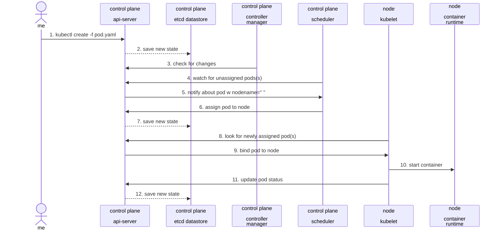
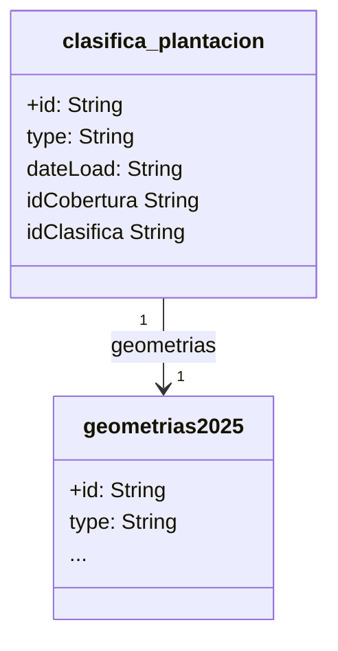

La edad de las plantaciones es un factor crucial en la agricultura, especialmente en cultivos leñosos y perennes como el olivar, los frutales y el viñedo, que son muy importantes en Andalucía. Se pueden clasificar las plantaciones por su edad de varias maneras, y cada fase tiene implicaciones diferentes en cuanto a manejo, producción y rentabilidad.

:::tip

La idea de este packages normaliza la información _raster_ del moddelo digital normalizado de vegetación disponible como url (https://wcs-mds.idee.es/mds). Esta información y archivos en formato _raster_ esta disponible en la web (https://idee.es) y corresponden a datos de las coberturas LiDAR a ravñes de vuelos de dron.

:::

La idea de este packages normaliza la información raster del moddelo digital normalizado de vegetación disponible como url (https://wcs-mds.idee.es/mds). Este información y archivos en formato raster esta disponible en la web idee.es y corresponden a datos de las coberturas LiDAR a ravñes de vuelos de dron.

## Metodología

CodeBlocks

```jsx title="/src/components/HelloCodeTitle.js"
function HelloCodeTitle(props) {
  return <h1>Hello, {props.name}</h1>;
}
```

Diagramas





## Herramientas necesarias

## Recursos de entrada

## Recursos de Salida